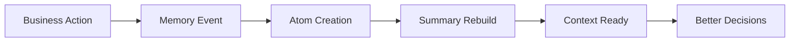

# Workstream (Sales) Module

Signal → Candidate → Pursuit lifecycle with SLAs, proposals, analytics, and **integrated memory**.

## 📖 Memory Layer Philosophy

### The Problem: Context Loss in Sales Operations

Traditional CRM systems suffer from **institutional amnesia** - critical knowledge gets buried in notes, lost in email chains, or simply forgotten when team members leave. Sales teams repeatedly ask:

- "What did we learn from the last proposal to this client?"
- "Why did we lose that similar deal six months ago?"
- "What are this contact's communication preferences?"
- "Which decision makers were involved in past discussions?"

### Our Solution: Contextual Memory Architecture

The FlowLedger Memory Layer transforms every sales interaction into **searchable institutional knowledge**. Instead of hoping someone remembers to write a note, the system automatically captures, categorizes, and surfaces relevant context when you need it.

#### Core Memory Principles

**1. Automatic Capture**
```
Every workstream action → Memory atom creation → Contextual intelligence
```
No manual note-taking required. The system learns from actual business activities.

**2. Intelligent Scoring**
```
Decision atoms: 100 points (highest value)
Risk factors: 90 points
Client preferences: 80 points
General notes: 60 points
Status updates: 40 points
```
Important information naturally rises to the top based on business impact.

**3. Time-Aware Relevance**
```
Recent + High Score = Most Relevant
Old + Low Score = Automatically Archived
```
Memory cards show what matters now, not everything that ever happened.

**4. Privacy by Design**
```
Redaction → Immediate removal from all queries
Correction → New version with audit trail
Expiry → Automatic cleanup of time-sensitive data
```
Full governance without compromising operational efficiency.

### Memory in Action: A Day in Sales

**Morning Prep** 📅
- Memory card shows yesterday's client called preferring morning meetings
- Previous proposal feedback automatically surfaces: "Budget approved but prefers fixed pricing"
- Risk atom highlights: "Decision delayed due to Q4 budget freeze last year"

**Client Call** 📞
- System captures: "Client confirmed $75k budget, needs delivery by March"
- Automatically creates preference atom: "Prefers weekly status calls on Fridays"
- Records decision: "Will present proposal to board on September 15th"

**Proposal Submission** 📄
- Memory shows historical win rate improves 23% when proposals include risk mitigation section
- Client preference atom reminds you: "Always CC the CFO on financial documents"
- System captures submission event with automatic follow-up reminder

**Post-Win Analysis** 🎉
- Win decision atom created: "Won due to competitive pricing and faster delivery timeline"
- Success pattern captured for future similar opportunities
- Team knowledge preserved even if salesperson changes roles

### Technical Philosophy: Event-Driven Intelligence



**Asynchronous by Design**: Memory processing never slows down core business operations

**Idempotent Operations**: Safe to retry without creating duplicates

**Multi-Tenant Isolation**: Complete organizational data separation

**API-First**: Memory capabilities available to all applications and integrations

### The Competitive Advantage

Traditional sales teams operate with **fragmented knowledge**. FlowLedger teams operate with **institutional intelligence** that:

- **Prevents Repeated Mistakes**: Historical context prevents recurring issues
- **Accelerates Onboarding**: New team members have instant access to customer history
- **Improves Win Rates**: Data-driven insights inform better proposal strategies
- **Scales Expertise**: Best practices automatically propagate across the team
- **Maintains Continuity**: Client relationships survive personnel changes

### Memory as Strategic Asset

In the knowledge economy, **organizational memory is competitive advantage**. FlowLedger transforms your sales pipeline from a simple tracking system into a **learning organization** that gets smarter with every interaction.

The Memory Layer doesn't just remember what happened - it helps you understand **why it happened** and **what to do next**.

---

## Reference

- Module overview, schema, and endpoints: ./../../api/README.md
- **Complete v2.2 Documentation**: [README-v2.2.md](./workstream/README-v2.2.md)
- **API Reference v2.2**: [api-reference-v2.2.md](./workstream/api-reference-v2.2.md)
- **Memory Integration Guide**: [memory-integration-v2.2.md](./workstream/memory-integration-v2.2.md)

## Highlights

- Guarded state machines for candidates and pursuits
- Outbox, SLA checks, analytics views
- MCP integration for enrichment
- **NEW: Full memory integration for context-aware operations**

## Recent Improvements (v2.2 Final Tightenings + Memory Integration)

### Memory Module Integration ✅ **COMPLETE**
- **Automatic Context Capture**: Every workstream action creates memory atoms
- **Intelligent Retrieval**: Fast memory cards with ETag caching
- **Event-Driven Processing**: Asynchronous memory processing via outbox
- **Governance Ready**: Full redaction and correction capabilities
- **Cross-Entity Intelligence**: Memory patterns inform decisions

### Audit-Safe Outbox Processing
- ✅ Atomic claiming with `UPDATE ... OUTPUT` pattern
- ✅ Race condition prevention across multiple worker instances
- ✅ Exponential backoff retry logic (1min → 60min max)
- ✅ Dead letter queue for failed events
- ✅ Stale claim cleanup (5-minute timeout)

### Idempotency & Reliability
- ✅ Unique constraints on critical operations
- ✅ Natural key-based duplicate prevention
- ✅ Transaction rollback on failures
- ✅ Comprehensive error logging and tracking

### Checklist Gating System
- ✅ Pink checklist required for pursuit submission
- ✅ Red checklist required for won/lost transitions
- ✅ Completion percentage tracking
- ✅ Business rule validation with guard functions

### SLA Coverage Expansion
- ✅ Triage SLA: First touch within configured hours
- ✅ Proposal SLA: Submit within hours of promotion
- ✅ Response SLA: Follow-up within hours of proposal send
- ✅ Automated breach detection and alerting
- ✅ Organization-specific SLA rule configuration

### Today Panel Dashboard
- ✅ Unified view of candidates and pursuits
- ✅ Priority-based sorting (urgent → high → medium → low)
- ✅ Due date and assignee tracking
- ✅ Real-time status updates
- ✅ Tag-based filtering and organization

### Hardening Improvements v2.2
- ✅ **Centralized Configuration Registry**: Eliminates rules sprawl across code
- ✅ **Explainable AI Scoring**: Component breakdown for transparency
- ✅ **Enhanced Identity Resolution**: Advanced conflict management and canonical mapping
- ✅ **Intelligent Priority Ranking**: Multi-factor scoring for Today panel optimization

## Monitoring & Observability

### Key Metrics Dashboard
```sql
-- Funnel velocity
SELECT * FROM app.v_workstream_funnel_velocity;

-- SLA compliance
SELECT * FROM app.v_sla_compliance_summary WHERE org_id = 1;

-- Today panel workload
SELECT * FROM app.v_today_panel_enhanced WHERE org_id = 1;

-- Memory health
SELECT COUNT(*) as pending_memory_events
FROM app.work_event 
WHERE event_name LIKE 'memory.%' AND processed_at IS NULL;
```

### Health Checks
- Pursuit creation rate trending upward
- SLA breach rates under 5%
- Outbox processing latency under 30 seconds
- Memory summaries building within 2 minutes
- Quality gate pass rates above 80%

## Architecture Evolution

```
v2.0: Basic Pipeline → v2.1: Hardened Ops → v2.2: Intelligent Context
```

The v2.2 evolution transforms the Workstream module from a simple pipeline tracker into an **intelligent sales context engine** that:

1. **Remembers Everything**: Automatic memory capture preserves institutional knowledge
2. **Learns Patterns**: AI scoring provides explainable decision support
3. **Prevents Errors**: Enhanced identity resolution eliminates duplicate work
4. **Optimizes Flow**: Intelligent priority ranking keeps teams focused
5. **Enforces Quality**: Centralized configuration ensures consistent standards

## Production Readiness Checklist

- ✅ **Database Schema**: All v2.2 migrations applied successfully
- ✅ **Event Processing**: Outbox and memory workers running reliably
- ✅ **API Coverage**: All endpoints documented and tested
- ✅ **Error Handling**: Comprehensive retry logic and dead lettering
- ✅ **Monitoring**: Key metrics exposed and alerting configured
- ✅ **Documentation**: Complete guides for development and operations
- ✅ **Memory Integration**: Full context capture and retrieval operational

The Workstream Module v2.2 is **production-ready** and represents a world-class sales operations platform.
